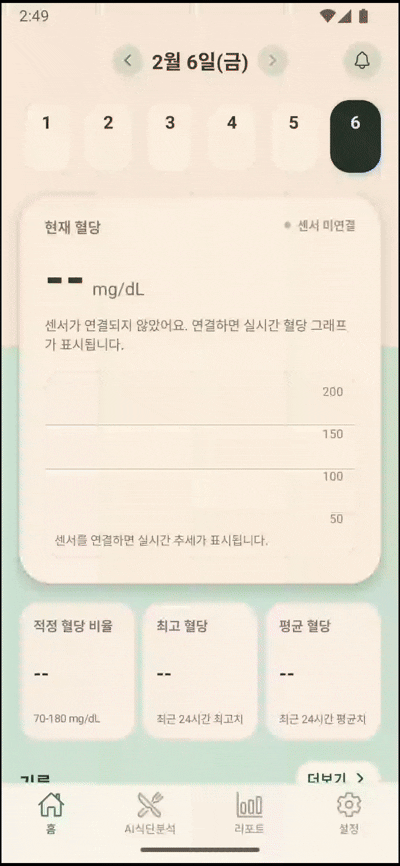
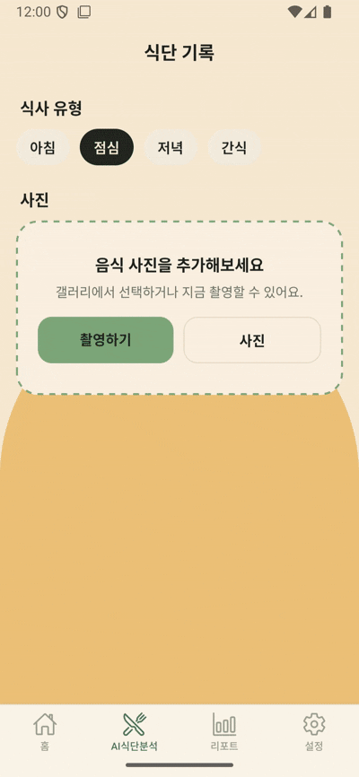
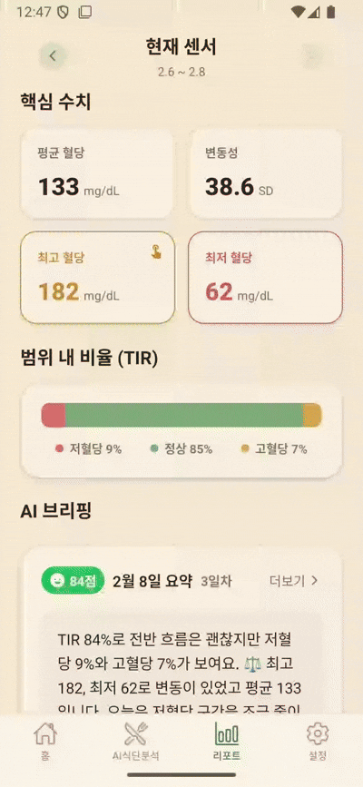

# 🌱 당낭콩


</div>

---

## 💚 프로젝트 소개

### 혈당이 오를 때마다

### 수치를 확인하느라 번거롭지 않나요?

식단 사진 **한 장**으로
👉 음식 분석
👉 혈당 변화 예측까지
한 번에 확인할 수 있다면,
혈당 관리는 훨씬 쉬워집니다.


### 흩어진 기록을 모아

### 패턴을 파악하느라 시간이 부족하지 않나요?

혈당, 식단, 변화를 자동으로 정리해
👉 **하루 · 주간 · 월간 리포트**로 제공하고
👉 중요한 변화만 **알림**으로 알려드립니다.


### 이제 **당낭콩**으로

### 혈당 관리의 부담을 덜어보세요.

당낭콩은
**기록은 자동으로**,
**관리는 직관적으로**,
**일상은 더 안전하고 편리하게** 만들어줍니다.

> 📸 찍고 · 📊 확인하고 · 🔔 놓치지 않는
> **스마트 혈당 관리 서비스, 당낭콩**

---

## 💚 프로젝트 기간
2026.01.12 ~ 2025.02.09 (4주)

---

## 💚 주요 기능
- CGM 혈당 데이터 수집 및 모니터링
- 식단 사진 분석 및 음식명 추정
- 혈당 예측 그래프 생성
- AI 코칭(섭취 가이드) 생성
- 알림/리포트/설정 기능

---

## 💚 기술 스택

### **Backend - Spring Boot**

     <br>
     <br>
 

### **AI Server - FastAPI**

    <br>
   

### **Mobile - Expo (React Native)**

    <br>
  

### **CI/CD & Infra**

  

---

## 💚 프로젝트 폴더 구조

### Back-end (Spring Boot)
<details>
  <summary>펼쳐보기</summary>

```plaintext
apps/backend/dnc
├── Dockerfile
└── src
    └── main
        ├── java
        │   └── com
        │       └── djjko
        │           └── dnc
        │               ├── ai
        │               ├── alert
        │               ├── auth
        │               │   ├── controller
        │               │   ├── dto
        │               │   ├── entity
        │               │   ├── repository
        │               │   ├── security
        │               │   └── service
        │               ├── common
        │               │   ├── config
        │               │   ├── exception
        │               │   ├── response
        │               │   └── util
        │               ├── config
        │               ├── error
        │               ├── glucose
        │               │   ├── client
        │               │   ├── controller
        │               │   ├── dto
        │               │   ├── entity
        │               │   ├── repository
        │               │   ├── scheduler
        │               │   └── service
        │               ├── learning
        │               ├── meal
        │               │   ├── controller
        │               │   ├── domain
        │               │   ├── dto
        │               │   ├── entity
        │               │   ├── repository
        │               │   └── service
        │               ├── model
        │               ├── notification
        │               ├── prediction
        │               ├── push
        │               ├── report
        │               ├── security
        │               ├── sensor
        │               ├── settings
        │               ├── storage
        │               └── user
        └── resources
            ├── db
            │   └── dnc_db.sql
            ├── static
            └── templates
```
</details>

### AI Server (FastAPI)
<details>
  <summary>펼쳐보기</summary>

```plaintext
apps/ai-server
├── Dockerfile
├── README.md
├── requirements.txt
└── ai
    ├── main.py
    ├── models
    ├── services
    └── settings
```
</details>

### Mobile (Expo)
<details>
  <summary>펼쳐보기</summary>

```plaintext
apps/mobile
├── app
│   ├── (auth)
│   ├── (settings)
│   └── (tabs)
├── assets
├── components
├── constants
├── hooks
├── lib
├── scripts
├── types
├── app.json
├── package.json
├── tsconfig.json
├── Dockerfile
└── nginx.conf
```
</details>

---

## 💚 팀원 소개
|  |  |  |  |  |  |
|---------------------------------------------------------------------------------------------------------------|----------------------------------------------------------------------------------------------------|---------------------------------------------------------------------------------------------------------------|-------------------------------------------------------------------------------------------------|--------------------------------------------------------------------------------------------------|--------------------------------------------------------------------------------------------------|
| 정관우([@JeongGwanWoo](https://github.com/JeongGwanWoo)) | 김대원([@devbigone](https://github.com/devbigone)) | 남윤서([@lazyyuns](https://github.com/lazyyuns)) | 차지훈([@hanjihun33](https://github.com/hanjihun33)) | 박상훈([@monon06629](https://github.com/monon06629)) | 손영록([@](https://github.com/surina125)) |
| Leader / Back-End + Infra | Back-End | Back-End | Full-Stack | AI | AI |

---

## 💚 협업 방식

- Git
  - [브랜치 전략 🔗](https://lilac-hour-2a7.notion.site/Commit-branch-conventions-2edfab98905a80d09439de9813790eab)
  - MR시, 팀원이 코드리뷰를 진행하고 피드백 게시

- JIRA
  - 작업 단위에 따라 `Epic-Story` 분류
  - 매주 목표량을 설정하여 Sprint 진행
  - 업무의 할당량을 정하여 Story Point를 설정하고, In-Progress -> Done 순으로 작업

- 회의
  - 데일리 스크럼 9시 당일 업무 브리핑
  - 문제 상황 지속 시 MatterMost 메신저를 활용한 공유 및 도움 요청

- Notion
  - 회의록 기록하여 보관
  - 컨벤션, 트러블 슈팅, 개발 산출물 관리
  - GANTT CHART 관리


## 💚 프로젝트 산출물

- [요구사항명세서](./docs/요구사항명세서.md)
- [기능명세서](./docs/기능명세서.md)
- [와이어프레임](./docs/와이어프레임.md)
- [API명세서](./docs/API명세서.md)
- [ERD](./docs/ERD.md)
- [아키텍처](./docs/아키텍처.md)

## 💚 프로젝트 결과물

- [포팅메뉴얼](./exec/포팅_메뉴얼.md)
- [중간발표자료](./docs/당낭콩_중간발표.pptx)
- [최종발표자료](./docs/당낭콩_최종발표.pdf)

## 💚 시연 영상

- [당낭콩 시연영상](https://youtu.be/sQhA71Rfi8A?si=BkgEeV3enu9SrsE3)

## 💚 화면 구성

### CGM 연동 및 실시간 혈당 그래프


### 음식 AI 분석 및 예측 혈당 분석 그래프 


### 리포트 페이지

